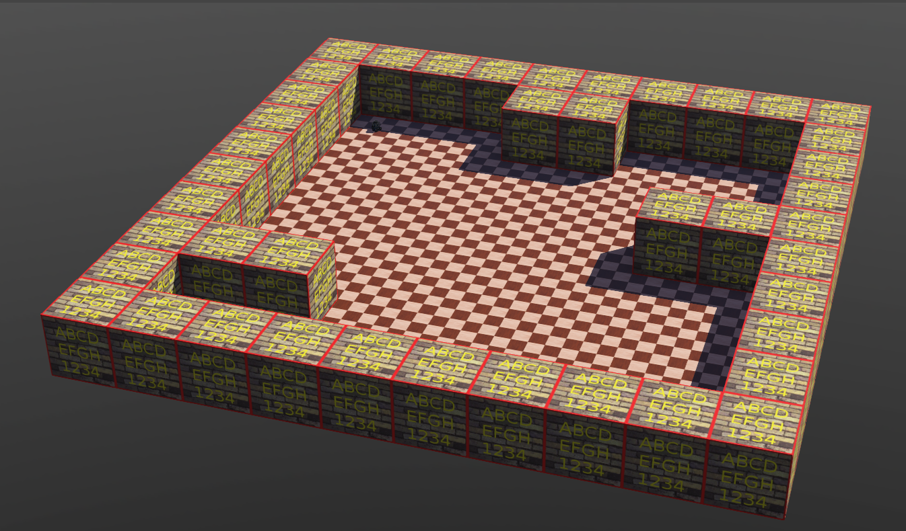

# Robot Simulators

## Webots

This project contains the files necessary to move a robot from its starting position to a goal, in this case a TurtleBot Burger, on a map generated in a particular way based on the surnames of the author.

### `map.wbt`

This file contains the map generated by `webots-map-from-csv_R2021a.py` using the `assets/map1.csv` file. The CSV file is designed based on the author's surnames (**Godoy Calvo**), with the size of the X and Y dimensions being the length of the surnames.

    

### `my_controller`

This folder contains the `my_controller.cpp` file, which specifies how the exploration should be done.

